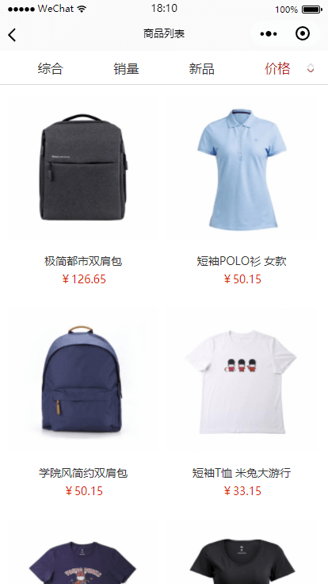
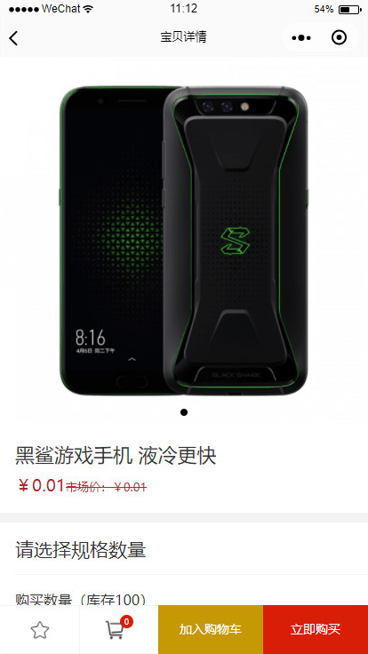
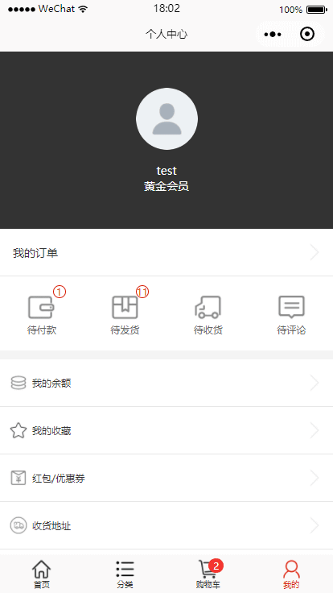

# weeshop
ECShop 微信小程序商城，基于3.6版本 appserver 接口，100% 兼容原有程序。
> 注意：本项目还在开发中，功能还未完善，请匆商用。
> 项目内容基于 ECShop 3.6 的 API 接口，如需二次开发，请参考 appserver 源码

# 欢迎 S T A R T

# 功能 Function
+ [x] 首页：
轮播图、滚动公告、精品推荐、新品上市、销量排行

+ [x] 分类：
分类目录

+ [x] 我的：
退出登录、用户信息显示、订单统计

+ [x] 列表：
商品排序、商品列表

+ [x] 搜索：
商品搜索、热门搜索

+ [x] 商品详情：
商品详情、规格选择、加入购物车、立即购买、评价详情、收藏功能

+ [x] 登录「默认微信登录」：
用户登录、用户注册、找回密码

+ [x] 购物车：
数量修改、商品删除、检查订单、提交支付、购物车数字

+ [x] 订单中心：
订单列表、详单详情、物流信息、取消订单、订单付款、确认收货、评价订单

+ [x] 收货：
地址列表、地址详情、地址编辑、地址添加、快递选择

+ [x] 余额：
余额支付、余额详情、余额记录、余额提现、余额提现记录

+ [x] 公告：
公告列表、公告详情

+ [x] 收藏：
收藏列表、删除收藏

+ [x] 评价：
评价列表、评价提交

+ [x] 用户信息：
用户信息、等级详情、折扣详情

+ [x] 红包/优惠券：
红包列表、优惠券列表、x使用红包x、x使用优惠券x

+ [x] 积分：
积分记录列表、x使用积分x

+ [ ] 微信：
微信登陆、微信支付

+ [ ] 文章：
文章列表、文章详情

+ [ ] 密码：
修改密码

+ [ ] 分成：
推荐记录、分成规则、推荐规则

+ [ ] 其它功能正在开发中...

# 预览 Previews

## 进度 progress
目前已经完善基本商城购物流程，支持余额支付、微信支付、微信登录。

## 前提概要 Prerequisites
如果你不懂搭建 ECShop 3.6 ，请**必须**跟着该先决条件进行操作。

1、你的文件目录结构**必须**为如下
`bash
└─example
  ├─ecshop
  │  ├─admin
  │  ├─...
  │  ├─...
  │  ├─...
  │  └─widget
  └─appserver
     ├─app
     ├─bootstrap
     ├─config
     ├─database
     ├─public
     ├─resources
     ├─storage
     ├─tests
     └─vendor
`
2、你的本地 ecshop 测试地址**必须**为 ecshopdemo.com 该域名的**必须**根目录是 `example/ecshop`

3、你的本地 api 测试地址**必须**为 api.ecshopdemo.com 该域名的**必须**根目录是 `example/appserver/public`

4、**请确保前三项为正确的，再继续**。
4.1、建议安装的 PHP 环境皆为 5.6 及以上版本

5、打开本地商城域名 ecshopdemo.com 根据提示安装 ecshop 商城，确保安装顺利，并勾上「安装演示数据」

6、安装完成！

## 使用 How to use ?
1、安装 ecshop 3.6 版本
`暂定域名为 example.com ，指向到服务器 example 目录下的 ecshop 目录`

2、安装 ecshop 3.6 版本 appserver
`暂定域名为 api.example.com ，指向到服务器 example 目录下的 appserver 目录的 public 文件夹`

3、构建小程序，选择 weeshop 目录

4、打开 weeshop 目录下的 utils 目录中的 utils.js

5、修改 `shopUrl = 'ecshop.com'` 为 `shopUrl = 'example.com'`

6、可选：如果为 HTTPS 网站，则修改 `https = false` 为 `https = true`

## 反馈 Issues
本人博客文章关联了该项目，如果有疑问，可通过文章评论功能提交你的疑问。

博客链接地址：https://www.darlang.com/?p=709

标题: [ECShop 小程序「weeshop 」- 基于 ECShop 3.6 版本开发的非官方微信小程序](https://www.darlang.com/2018/03/ecshop-xiao-cheng-xu-weeshop-ji-yu-ecshop-3-6-ban-ben-kai-fa-de-fei-guan-fang-wei-xin-xiao-cheng-xu/)

如需反馈，请在博客文章评论区域回复讨论，**我只在博客评论区域回复**。

## 关于 weeshop
基于原 tumobi 的基础修正多处错误，增加并完善商城功能。

小程序项目使用接口为 ECShop 3.6 版本的 appserver。

项目为个人测试使用，如要用于商业用途，请先取得 ECShop 的授权。
